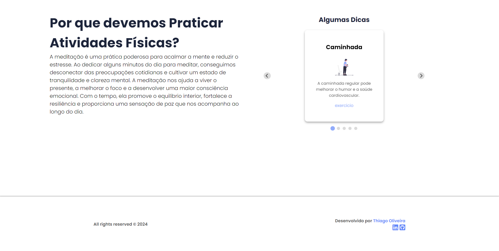

# Landing Page de Dicas de Bem-Estar

## Descrição do Projeto

Este projeto consiste em uma landing page interativa que consome uma API desenvolvida por mim, oferecendo dicas para o bem-estar físico e mental. O design é intuitivo, permitindo que os usuários naveguem facilmente entre diferentes seções que categorizam as dicas. Cada dica é apresentada em um card visualmente atraente, proporcionando uma experiência agradável e enriquecedora.

## Funcionalidades

- Apresentação de dicas em cards organizados por categorias.
- Navegação suave entre seções.
- Integração com uma API que retorna as dicas dinamicamente.
- Carrossel de dicas para melhor visualização.

## Tecnologias Utilizadas

 **React**: Biblioteca JavaScript para criação de interfaces de usuário.
- **Vite**: Ferramenta de build rápida e leve para desenvolvimento de aplicações com React.
- **HTML**: Estruturação da página.
- **CSS**: Estilização da página, com foco em design responsivo.
- **JavaScript**: Lógica de manipulação do DOM e requisições à API.
- **Axios**: Biblioteca para facilitar requisições HTTP.
- **Splide JS**: Implementação de carrossel de dicas.
- **ScrollReveal JS**: Implementação de efeoto de rolagem.
- **Node.js**: Ambiente de execução para JavaScript no servidor (para a API).

### Versões das Tecnologias

- **React 18.0.0**
- **HTML5**
- **CSS3**
- **JavaScript ES6**
- **Axios 0.21.1**
- **Splide JS 3.6.12**
- **ScrollReveal JS 4.0.9**
- **Node.js 14.17.0** (para a API)

## Passo a Passo para Execução do Projeto

### 1. Clone o repositório

```bash
git clone https://github.com/ThiagoOliveiraJ/miniprojetom4.git
cd miniprojetom4
```

## 2. Inicialize o repositório
```bash
npm dev run
```

## Repositório da API

Você pode acessar a API hospedada [aqui](https://github.com/ThiagoOliveiraJ/miniprojetom4git).

## Preview do Projeto




Para dúvidas ou feedback ou contato:

- **Nome**: Thiago Oliveira
- **Email**: contatothiagooliveira1@gmail.com
- **Linkedin**: [Thiago Oliveira](https://www.linkedin.com/in/thiago-oliveira-631862248/)